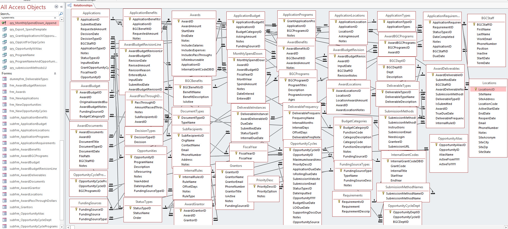

# Access-Database-extended-grants

# Departmental Usage Overview
This data model was designed from the perspective of a Grants department 
for a nonprofit responsible for the entire grant cycle. This included but
not limited to grant opportunity tracking, application tracking, award tracking, 
budget management, compliance, grant impact tracking and financial reporting.

Different roles interact with the database in different ways:
- Vice President of Grants and Government Affairs is responsible for strategic oversight of grant funding and government relationships 
- Grants Manager is responsible for maintaining grantor contact information, pass-through reports, and budget revisions.
     - As well as the oversight for the Grant Administrators and Grant Writer
- Grants administrators manage post awards deliverables and some financial reporting.
- Grants Writer is responsible for grant opportunities, reapplying for grants and completing applications. 
- Leadership uses aggregated reports for oversight and planning.
- Finance Department uses aggregated reports for accruals, and revenue tracking.

 # Core Workflows Supported

1. Grant Opportunities
   - An opportunity comes from either a previous grant in past years / awards, or a contact.
2. Award
   - A new grant award is created and assigned an internal grant code
   - The original approved budget is recorded at both summary and line-item levels
3. Budget Revisions
   - Budget amendments are stored separately from the original award
   - Revision line items allow tracking increases and reallocations over time
4. Spending & Monitoring
   - Monthly spending is recorded against awards
   - Remaining balances are calculated dynamically from original + revised budgets
5. Reporting & Oversight
   - Staff can report on total spent vs budget
   - Leadership can identify overspent or underutilized grants
  

  
# Design Rationale

- Awards and budgets are separated to allow multiple revisions over time
- Line-level tables enable detailed reporting without overwriting historical data
- Monthly spending tables support trend analysis and auditability
- Lookup tables normalize codes to ensure consistent reporting

# Scope & Assumptions

This model represents a conceptual design intended to reflect real-world
grant administration workflows. It is not a deployed production system,
but a data modeling exercise focused on structure, logic, and reporting needs.

## Organizational & Operational Assumptions
- The organization manages multiple grants simultaneously, often across overlapping fiscal years, programs, and sites.
- Grants follow a general lifecycle:
     - Opportunity → Opportunity Cycle → Application → Award, with optional amendments and revisions.
- A single opportunity may have multiple cycles over time, and multiple awards may exist for the same program across years.
- Staff roles are separated (grant manager, grants administrator, finance/accounting), but all interact with shared data.
- Data accuracy, traceability, and audit readiness are higher priorities than speed of entry alone.

## Data Entry & Usage Assumptions
- Users are not database experts and require:
     - User-friendly dropdowns
     - Cascading combo boxes
     - Pre-filled defaults
     - Minimal exposure to internal IDs
     - Many values (statuses, frequencies, submission methods, funding source types) must be standardized via lookup tables to prevent spelling and formatting inconsistencies.
     - Users may need to add new lookup values on the fly (via Not-In-List forms) without breaking referential integrity.

## Grants & Financial Assumptions
Grants may:
- Start or end mid–pay period
- Cover different combinations of wages, benefits, passthroughs, and indirect costs
- Require monthly, quarterly, or custom deliverables
- Budget tracking must support:
- Original awards
- Revisions
- Amendments
- Monthly spend downs
- Payroll data originates in an external system (Paycom) and may be imported for reconciliation, allocation, and reporting.
- Accounting requires actuals and accruals based on internal locations, not just grant allocations.

  ## Structural Assumptions
Historical accuracy is critical:
     - Sites may change names or merge
     - Grantor contacts may change over time
     - Program structures may evolve
     - Records should not be overwritten when real-world structures change; instead, changes should be versioned or date-bound.
     - Auditability matters more than minimizing table count.

# Lessons Learned
Designing this database surfaced several important lessons about building real-world data systems for complex nonprofit operations.

1. Real Life Is Not Clean or Predictable
- Grant management rarely follows a perfect linear flow. Mid-year amendments, partial awards, overlapping funding periods, and evolving reporting requirements forced the design to remain flexible and extensible rather than overly rigid.
Lesson: Design for change, not perfection.

2. Separation of “Definition” vs “Instance” Is Essential
Many early design challenges were solved by clearly separating:
- Definitions (e.g., Deliverable Types, Submission Methods, Funding Sources)
- Instances (e.g., Deliverable Instances, Award-Specific Submission Instructions)
This avoided duplication while still allowing customization at the award level.
Lesson: Normalize definitions, but allow instance-level overrides where the real world demands it.

3. IDs Are for Databases — Humans Need Context
Users think in terms of:
- Program names
- Fiscal years
- Opportunity cycles
- Sites and staff roles
They do not think in IDs.
Lesson: Store IDs, display descriptive fields via queries and combo boxes.

4. Auditability Is Not an Afterthought
Tracking Created By / Created Date / Modified By / Modified Date (or a full audit log) became critical once the scale of the system grew.
Lesson: Assume that every data point may be questioned later — design accordingly.

5. One Table Rarely Solves a Complex Question
Questions like:
“Which grants are active for this pay period?”
“Which benefits are allowable for this grant?”
“Which deliverables are due next month?”

All required query layers, not just table design.
Lesson: Tables store facts; queries create meaning.

6. Avoid Polymorphic Shortcuts in Relational Databases
Attempts to store multiple parent relationships (e.g., one Grantor linked to either an Opportunity or an Award via a single table) introduced ambiguity and risk.
Lesson: Clarity beats cleverness — explicit linking tables scale better.

7. Anticipate Future Data, Not Just Current Needs
Scenarios such as:
- Site mergers
- Additional award funding
- Changing grantor contacts
- Revised submission portals
- Payroll imports and benefit calculations
  
All reinforced the need to model history, not overwrite it.
Lesson: If it might change, it probably will.

8. Forms Should Enforce Business Rules, Not Just Collect Data
Cascading combo boxes, default values, validation rules, and controlled workflows were just as important as the schema itself.
Lesson: Good forms prevent bad data long before reports reveal it.
